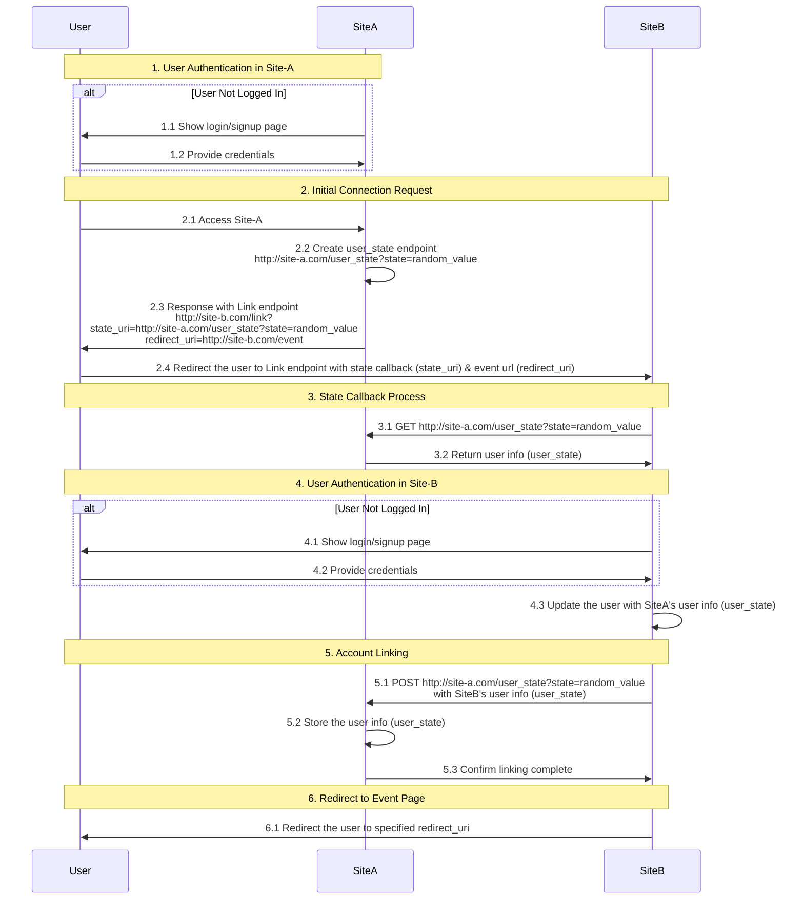
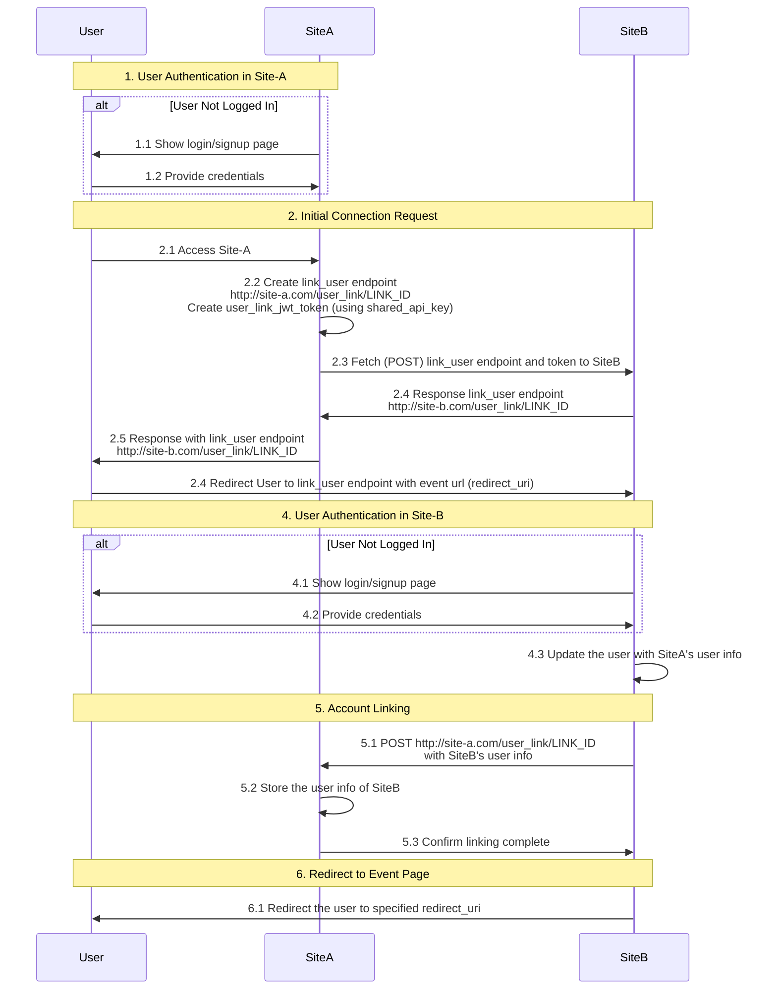
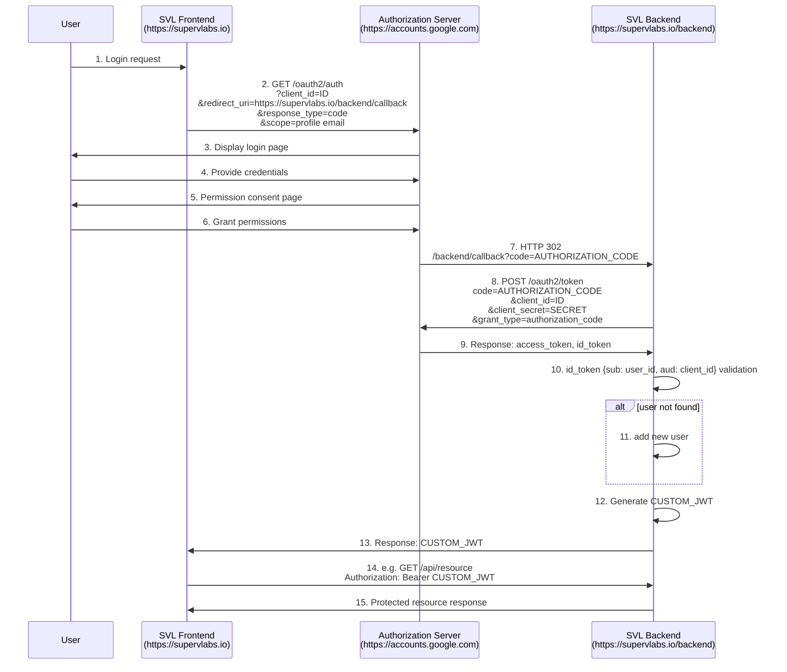

# Testbed for linking users between two sites

## Prerequisite

- docker
- Linux

## Test implementation Framework

- Frontend: implemented with Next.js
- Backend: implemented with Express

## Set up Google OAuth2

1. Visit [Google Developers Console](https://console.developers.google.com/project)
2. Create a project > APIs & Services > Create OAuth 2.0 Client

   - You need to create two clients (e.g. account-linking-siteA, account-linking-siteB)

3-1. Create Oauth 2.0 Client IDs for account-linking-siteA

- Go to APIs & Services > Credentials with account-linking-siteA project
- Click CREATE CREDENTIALS > OAuth client ID
- click 'CONFIGURE CONSENT SCREEN', if needed.
- Application type is 'Web application'
- Add the following urls in Authorized redirect URIs

```
http://localhost:3030/auth/callback/google
http://localhost:3031/auth/callback/google
http://127.0.0.1:3030/auth/callback/google
http://127.0.0.1:3031/auth/callback/google
```

- Make sure you copy the Client ID and Client secret

3-2. Iterate 3-1 for another project (e.g. account-linking-siteB)

4. Add test users if needed

5. Copy the Google Client ID and secrets, then update the following environment variables
   - `NEXT_PUBLIC_GOOGLE_CLIENT_ID`
   - `GOOGLE_CLIENT_SECRET`

## Create Environment Variable Files in the project root

```bash
# .env.site-a
cat << EOF > .env.site-a
NEXT_PUBLIC_SITE_DOMAIN=localhost
FRONTEND_PORT=3000
BACKEND_PORT=3030
NEXT_PUBLIC_FRONTEND_URL=http://\$NEXT_PUBLIC_SITE_DOMAIN:\$FRONTEND_PORT
NEXT_PUBLIC_BACKEND_URL=http://\$NEXT_PUBLIC_SITE_DOMAIN:\$BACKEND_PORT
NEXT_PUBLIC_GOOGLE_CLIENT_ID=<Copy site A's ID>
GOOGLE_CLIENT_SECRET=<Copy site A's Secret>
JWT_SECRET=abcd
REDIS_PASSWORD=svladmin_passwd12
DATABASE_PASSWORD=svladmin_passwd12
SHARED_API_KEY=XXX
SERVICE_NAME=play3
EOF

# .env.site-b
cat << EOF > .env.site-b
NEXT_PUBLIC_SITE_DOMAIN=127.0.0.1
FRONTEND_PORT=3001
BACKEND_PORT=3031
NEXT_PUBLIC_FRONTEND_URL=http://\$NEXT_PUBLIC_SITE_DOMAIN:\$FRONTEND_PORT
NEXT_PUBLIC_BACKEND_URL=http://\$NEXT_PUBLIC_SITE_DOMAIN:\$BACKEND_PORT
NEXT_PUBLIC_GOOGLE_CLIENT_ID=<Copy site B's ID>
GOOGLE_CLIENT_SECRET=<Copy site B's Secret>
JWT_SECRET=defg
REDIS_PASSWORD=svladmin_passwd12
DATABASE_PASSWORD=svladmin_passwd12
SHARED_API_KEY=XXX
SERVICE_NAME=supervlabs
EOF
```

## Run the testbed

- Export environment variables and run docker compose
- Execute the following two commands in separate terminals

```bash
# Run the two sites
set -a && source .env.site-a && set +a && docker compose -p site-a up --build
set -a && source .env.site-b && set +a && docker compose -p site-b up --build

```

- Launch the browser (e.g. Chorme) and open two tabs.
- One for http://localhost:3000/ and the other for http://127.0.0.1:3001
- Access any site (e.g. http://localhost:3000/) and login
- Click 2. Link your accounts with scenario v1
- Paste the opponent's url (e.g. 'http://127.0.0.1:3001/link') in User Link URI
- Click 'Create Link' and Go To link (via the link created)

## Stop the testbed

- The `-v` option also removes docker volumes (database)

```bash
# Stop and remove all resources of them
set -a && source .env.site-a && set +a && docker compose -p site-a down -v
set -a && source .env.site-b && set +a && docker compose -p site-b down -v
```

## Help

### Access to the databases

You can access the databases using the following commands

```bash
# Access to the databases
set -a && source .env.site-a && set +a
docker compose -p site-a exec db psql -U svladmin -d svldatabase

set -a && source .env.site-b && set +a
docker compose -p site-a exec db psql -U svladmin -d svldatabase
```

## Account Link flow (scenario v1)

- `user_state`: Temporary storage path for user information
- Service endpoint is specified

Key endpoints used:

- `http://site-a.com/user_state?state=random_value` - User state endpoint created by Site-A to store temporary user information
- `http://site-b.com/link?state_uri=http://site-a.com/user_state?state=random_value&redirect_uri=http://site-b.com/event` - Link endpoint on Site-B that includes the state callback and redirect URI
- `http://site-b.com/event` - The redirect URI where the user is sent after account linking is complete

### Service endpoint 설정

- `http://localhost:3000` ==> `http://127.0.0.1:3001/link`
- `http://127.0.0.1:3001` ==> `http://localhost:3000/link`



## Account Link flow (Scenario v2)

- The two sites share an apikey in advance
- The apikey is used as the secret key for JWT

Key endpoints used:

- `http://site-a.com/api/user_link?redirect_uri=REDIRECT_URI&user_link_uri=LINK_URI` - Initial request to create account link with redirect URI and link URI parameters
- `http://site-b.com/api/user_link` (POST) - Endpoint for Site A to send user link token to Site B
- `http://site-b.com/user_link/LINK_ID` - User-facing page for confirming account linking on Site B
- `http://site-a.com/api/user_link/LINK_ID` (GET) - API endpoint to retrieve user link information
- `http://site-a.com/api/user_link/LINK_ID` (POST) - API endpoint to complete the account linking process

### 연동 과정

1. 계정 연결 초기화 (Site A → Site B)

   - `http://site-a.com/api/user_link?redirect_uri=REDIRECT_URI&user_link_uri=LINK_URI`
   - 사용자가 인증된 상태에서 연결을 요청
   - 고유한 link_id를 생성하고 JWT 토큰에 사용자 정보를 포함

2. 사이트 간 정보 교환

   - `http://site-b.com/api/user_link` (POST)
   - Site A가 Site B에 x-user-link-token을 포함하여 요청
   - Site B가 user_link 정보를 검증하고 user_link 페이지 URL 반환

3. 사용자 링크 확인 및 접근

   - `http://site-b.com/user_link/LINK_ID`
   - 사용자가 Site B에서 인증 후 연결 확인

4. 사용자 정보 조회

   - `http://site-a.com/api/user_link/LINK_ID` (GET)
   - Site B가 연결된 사용자 정보를 조회

5. 계정 연결 완료

   - `http://site-a.com/api/user_link/LINK_ID` (POST)
   - Site B가 사용자 정보를 Site A에 전송
   - 양방향 계정 연결 확인 및 완료

### Service endpoint 설정

- `http://127.0.0.1:3001` ==> `http://localhost:3000/api/user_link`
- `http://localhost:3000` ==> `http://127.0.0.1:3001/api/user_link`



## Appendix - OAuth 2.0 authorization flow

OAuth 2.0 authentication process


